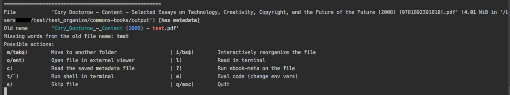
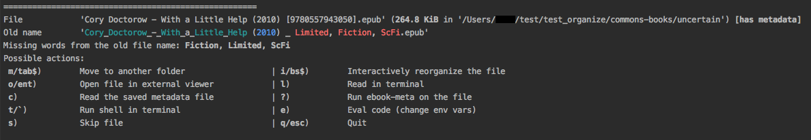

=====================
interactive-organizer
=====================
Interactively and manually organize ebook files quickly. This is a Python port of `interactive-organizer.sh <https://github.com/na--/ebook-tools/blob/master/interactive-organizer.sh>`_ 
from `ebook-tools <https://github.com/na--/ebook-tools>`_ written in shell by `na-- <https://github.com/na-->`_.

.. contents:: **Contents**
   :depth: 3
   :local:
   :backlinks: top
 
About
=====
Interactively and manually organize ebook files quickly. It is a very interesting script developed originally by `na-- <https://github.com/na-->`_
since you can manually check the files that were automatically renamed by `organized_ebooks <https://github.com/raul23/organize-ebooks>`_
directly in the terminal. Many useful operations can be performed through the terminal for each ebook that you want to check:

- read the file content (text conversion) from the terminal by leveraging the ``less`` command
- read the book's metadata from the corresponding ``.meta`` file
- provide the correct ISBN and the file will be renamed by fetching metadata from online sources
- and so on!

This is a Python port of `interactive-organizer.sh <https://github.com/na--/ebook-tools/blob/master/interactive-organizer.sh>`_ 
from `ebook-tools <https://github.com/na--/ebook-tools>`_ written in shell by `na-- <https://github.com/na-->`_.

Personally, this is the shell script from ``na--`` that I had the most fun porting* to Python since it shows the powerful and interesting
things you can do through the terminal and all via a Python script: you can even invoke a bash shell directly from the python script and then go 
back to the Python script as if nothing happened! 

What I also like is how ``na--`` had the great idea of highlighting the differences in the old
filename compared to the new one for a given renamed ebook. Similar words between both filenames are colored green and those missing
in the new filename are colored red. Hence you can quickly see if the file was renamed correctly.

|

\* all ``na--`` shell scripts were a lot of fun to port but this one really is special since you interact more with it than the others

`:star:` Other related Python projects based on ``ebook-tools``:

   - `convert-to-txt <https://github.com/raul23/convert-to-txt>`_: convert documents (pdf, djvu, epub, word) to txt
   - `find-isbns <https://github.com/raul23/find-isbns>`_: find ISBNs from ebooks (pdf, djvu, epub) or any string given as input to the script
   - `ocr <https://github.com/raul23/ocr>`_: run OCR on documents (pdf, djvu, and images)
   - `split-ebooks-into-folders <https://github.com/raul23/split-ebooks-into-folders>`_: split the supplied ebook files into 
     folders with consecutive names
   - `organize-ebooks <https://github.com/raul23/organize-ebooks>`_: automatically organize folders with potentially huge amounts of 
     unorganized ebooks. It leverages the first three previous Python scripts.

Dependencies
============
`:warning:` 

   You can ignore this section and go straight to pulling the `Docker image <#installing-with-docker-recommended>`_ which contains all the 
   required dependencies and the Python package ``interactive_organizer`` already installed. This section is more for showing how I setup my system
   when porting the shell script `interactive-organizer.sh <https://github.com/na--/ebook-tools/blob/master/interactive-organizer.sh>`_ et al. 
   to Python.

This is the environment on which the Python package `interactive_organizer <./interactive_organizer/>`_ was developed and tested:

* **Platform:** macOS
* **Python**: version **3.7**
* `textutil <https://ss64.com/osx/textutil.html>`_ or `catdoc <http://www.wagner.pp.ru/~vitus/software/catdoc/>`_: for converting *doc* to *txt*

  **NOTE:** On macOS, you don't need ``catdoc`` since it has the built-in ``textutil``
  command-line tool that converts any *txt*, *html*, *rtf*, 
  *rtfd*, *doc*, *docx*, *wordml*, *odt*, or *webarchive* file
* `DjVuLibre <http://djvu.sourceforge.net/>`_: it includes ``djvutxt`` for converting *djvu* to *txt*
  
    `:warning:` 
  
    - To access the *djvu* command line utilities and their documentation, you must set the shell variable ``PATH`` and ``MANPATH`` appropriately. 
      This can be achieved by invoking a convenient shell script hidden inside the application bundle::
  
       $ eval `/Applications/DjView.app/Contents/setpath.sh`
   
      **Ref.:** ReadMe from DjVuLibre
    - You need to softlink ``djvutxt`` in ``/user/local/bin`` (or add it in ``$PATH``)
* `poppler <https://poppler.freedesktop.org/>`_: it includes ``pdftotext`` for converting *pdf* to *txt*

`:information_source:` *epub* is converted to *txt* by using ``unzip -c {input_file}``

|

**Optionally:**

- `calibre <https://calibre-ebook.com/>`_: 

  - Versions **2.84** and above are preferred because of their ability to manually specify from which
    specific online source we want to fetch metadata. For earlier versions you have to set 
    ``ISBN_METADATA_FETCH_ORDER`` and ``ORGANIZE_WITHOUT_ISBN_SOURCES`` to empty strings.

  - for fetching metadata from online sources
  
  - for getting an ebook's metadata with ``ebook-meta`` in order to search it for ISBNs

  - for converting {*pdf*, *djvu*, *epub*, *msword*} to *txt* (for ISBN searching) by using calibre's 
    `ebook-convert <https://manual.calibre-ebook.com/generated/en/ebook-convert.html>`_
  
    `:warning:` ``ebook-convert`` is slower than the other conversion tools (``textutil``, ``catdoc``, ``pdftotext``, ``djvutxt``)

- **Optionally** `poppler <https://poppler.freedesktop.org/>`_, `catdoc <http://www.wagner.pp.ru/~vitus/software/catdoc/>`_ 
  and `DjVuLibre <http://djvu.sourceforge.net/>`_ can be installed for **faster** than calibre's conversion of ``.pdf``, ``.doc`` and ``.djvu`` files
  respectively to ``.txt``.

- **Optionally** the `Goodreads <https://www.mobileread.com/forums/showthread.php?t=130638>`_ and 
  `WorldCat xISBN <https://github.com/na--/calibre-worldcat-xisbn-metadata-plugin>`_ calibre plugins can be installed for better metadata fetching.

|

`:star:`

  If you only install **calibre** among these dependencies, you can still have
  a functioning program that will enable you to manually organize your ebook collections
  with the script ``interactive_organizer``: 
  
  * fetching metadata from online sources (very helpful feature for this particular script) 
    will work: by `default 
    <https://manual.calibre-ebook.com/generated/en/fetch-ebook-metadata.html#
    cmdoption-fetch-ebook-metadata-allowed-plugin>`__
    **calibre** comes with Amazon and Google sources among others
  * conversion to *txt* will work: `calibre`'s own ``ebook-convert`` tool
    will be used. However, accuracy and performance will be affected as explained 
    in the list of dependencies above.

Installing with Docker (Recommended) ⭐
=======================================
`:information_source:` 

  It is recommended to install the Python package `interactive_organizer <./interactive_organizer/>`_ with **Docker** because the Docker
  container has all the many `dependencies <#dependencies>`_ already installed along with the Python package ``interactive_organizer``. 
  I also included the original bash shell scripts from `ebook-tools <https://github.com/na--/ebook-tools>`_ by `na-- <https://github.com/na-->`_.

TODO

Installing the development version
==================================
Install
-------
`:warning:` 

   You can ignore this section and go straight to pulling the `Docker image <#installing-with-docker-recommended>`_ which contains all the 
   required dependencies and the Python package ``interactive_organizer`` already installed. This section is for installing the bleeding-edge
   version of the Python package ``interactive_organizer`` after you have installed yourself the many `dependencies <#dependencies>`_.
  
After you have installed the `dependencies <#dependencies>`_, you can then install the development (bleeding-edge) 
version of the package `interactive_organizer <./interactive_organizer/>`_:

.. code-block:: bash
 
   pip install git+https://github.com/raul23/interactive-organizer#egg=interactive-organizer
 
**NOTE:** the development version has the latest features 
 
**Test installation**

1. Test your installation by importing ``interactive_organizer`` and printing its
   version:
   
   .. code-block:: bash

      python -c "import interactive_organizer; print(interactive_organizer.__version__)"

2. You can also test that you have access to the ``interactive_organizer.py`` script by
   showing the program's version:

   .. code-block:: bash

      interactive_organizer --version

Uninstall
---------
To uninstall the development version of the package `interactive_organizer <./interactive_organizer/>`_:

.. code-block:: bash

   pip uninstall interactive_organizer

Script options
==============
List of options
---------------
To display the script `organize_ebooks.py <./find_iorganize_ebooks/scripts/organize_ebooks.py>`_ list of options and their descriptions::

   $ interactive_organizer -h
   usage: interactive_organizer.py [OPTIONS] {folder_to_organize} -o {output_folder} [{output_folder}]

   Interactively and manually organize ebook files quickly.

   This script is based on the great ebook-tools written in shell by na-- (See https://github.com/na--/ebook-tools).

   General options:
     -h, --help                                    Show this help message and exit.
     -v, --version                                 Show program's version number and exit.
     -q, --quiet                                   Enable quiet mode, i.e. nothing will be printed.
     --verbose                                     Print various debugging information, e.g. print traceback when there is an exception.
     -d, --dry-run                                 If this is enabled, no file rename/move/symlink/etc. operations will actually be executed.
     -s, --symlink-only                            Instead of moving the ebook files, create symbolic links to them.
     --log-level {debug,info,warning,error}        Set logging level. (default: info)
     --log-format {console,only_msg,simple}        Set logging formatter. (default: only_msg)

   Interactive options:
     --qm, --quick-mode                            This mode is useful when `organize_ebooks` was called with `--keep-metadata`. Ebooks that contain 
                                                   all of the tokens from the old file name in the new one are directly moved to the default output 
                                                   folder.
     --token-min-length LENGTH                     When files and file metadata are parsed, they are split into words and ones shorter than this value 
                                                   are ignored. By default, single and two character number and words are ignored. (default: 3)
     --tokens-to-ignore TOKENS                     A regular expression that is matched against the filename/author/title tokens and matching tokens 
                                                   are ignored. The default regular expression includes common words that probably hinder online 
                                                   metadata searching like book, novel, series, volume and others, as well as probable publication 
                                                   years like (so 1999 is ignored while 2033 is not).
                                                   (default: ebook|book|novel|series|^ed(ition)?$|^vol(ume)?$|(19[0-9]|20[0-2])[0-9])

   Input/Output options:
     folder_to_organize                            Folder containing the ebook files that need to be organized.
     -o, --output-folders [PATH [PATH ...]]        The different output folders to which you can quickly move ebook files. The first specified folder 
                                                   is the default.
     -c, --custom-move-base-dir PATH               A base directory in whose sub-folders files can more easily be moved during the interactive session 
                                                   because of tab autocompletion. (default: )
     -r, --restore-original-base-dir PATH          If you want to enable the option of restoring files to their original folders (or at least with the 
                                                   same folder structure), set this as the base path. (default: )
     --ome, --output-metadata-extension EXTENSION  This is the extension of the additional metadata file that is saved next to each newly renamed 
                                                   file. (default: meta)

Explaining some of the options/arguments
----------------------------------------
TODO

Script usage
============
Basic command
-------------
Let's say that we want to manually organize some books that were labeled as uncertain by the script 
`organize_ebooks <https://github.com/raul23/organize-ebooks>`_ that automatically organized a 
collection of ebooks. Here is a basic command that will allow you to manually inspect these uncertain
books::

   $ interactive_organizer ~/test/test_organize/commons-books/uncertain/

We will go through each of the options in the main menu using this simple command as a starter.

Open file in external viewer 
""""""""""""""""""""""""""""
Read the saved metadata file
""""""""""""""""""""""""""""
Run shell in terminal
"""""""""""""""""""""
Interactively reorganize the file
"""""""""""""""""""""""""""""""""
Read in terminal (with ``less``)
""""""""""""""""""""""""""""""""
Run ebook-meta on the file
""""""""""""""""""""""""""
Eval code (change env vars)
"""""""""""""""""""""""""""

Example: manually organize a collection of documents
====================================================
Through the script ``interactive_organizer.py``
-----------------------------------------------

Through the Python API
----------------------
